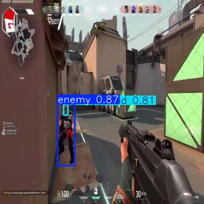
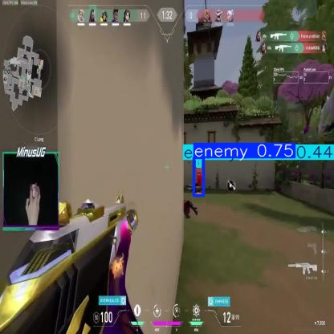

## Fine-Tuning Entire YOLOv11 Model
This directory contains the code, files, and instructions necessary to replicate the results. 

The dataset directory contains the data required for the training, validation, and testing sets in the format that the YOLO models expect.

The runs/detect directory contains the results produced from training and testing the YOLOv11 model.

The weights directory contains the initial pre-trained weights(yolo11n.pt) for the YOLOv11 model.

## Requirements
Dependencies needed on top of what is listed in the README for the parent directory
```
pip install ultralytics
```

To generate dataset in required format for YOLOv11
```
python generate_dataset.py
```

## Training Configuration

- **Batch Size**: 32
- **Epochs**: 100
- **Learning Rate**: 1e-3

## Usage 
To train and test the model, upload all the items in this directory to the working directory provided in the Kaggle notebooks. Enable the usage of a GPU. Install the required dependencies. Ensure the file structure assumed in yolov11.yaml and the kaggle_notebook.ipynb file matches the structure of the uploaded files in Kaggle. Execute each cell in kaggle_notebook.ipynb sequentially. When executing the cells, the runs/detect directory containing the results will be created relative to the current directory you are currently inside in Kaggle.

## Results
From Test Data


