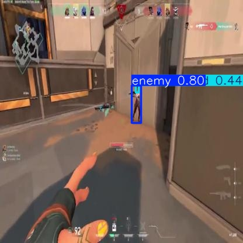
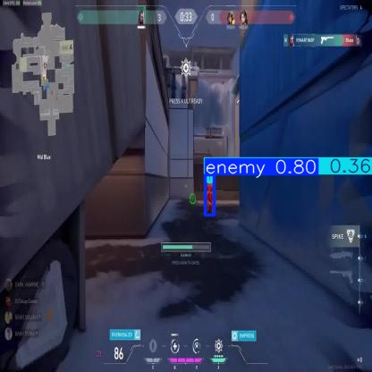

## Fine-Tuning YOLOv8 Model With Deepest Layers Frozen
This directory contains the code, files, and instructions necessary to replicate the results. 

The dataset directory contains the data required for the training, validation, and testing sets in the format that the YOLO models expect.

The runs/detect directory contains the results produced from training and testing the YOLOv8 model.

The weights directory contains the initial pre-trained weights(yolov8n.pt) for the YOLOv8 model.

## Requirements
Dependencies needed on top of what is listed in the README for the parent directory
```
pip install ultralytics
```

To generate dataset in required format for YOLOv8
```
python generate_dataset.py
```

We trained the YOLOv8 model with 6 different configurations: freezing the first 4, 5, 6, 7, 8, 9 layers of the YOLOv8 model. The model that performed the best ended up being the configuration for the YOLOv8 model where the first 4 layers were frozen. We only tested this configuration of the fine-tuned YOLOv8 model to produce the testing results.

## Training Configuration

- **Batch Size**: 32
- **Epochs**: 100
- **Learning Rate**: 1e-3

## Usage 
To reproduce the results, upload all the items in this directory to the working directory provided in the Kaggle notebooks. Enable the usage of a GPU. Install the required dependencies. Ensure the file structure assumed in yolov8.yaml and the kaggle_notebook.ipynb file matches the structure of the uploaded files in Kaggle. Execute each cell in kaggle_notebook.ipynb sequentially. When executing the cells, the runs/detect directory containing the results will be created relative to the current directory you are currently inside in Kaggle.

## Results
The best performing model ended up being the configuration for the fine-tuned YOLOv8 model where the first 4 layers were frozen.

From Test Data for best model


